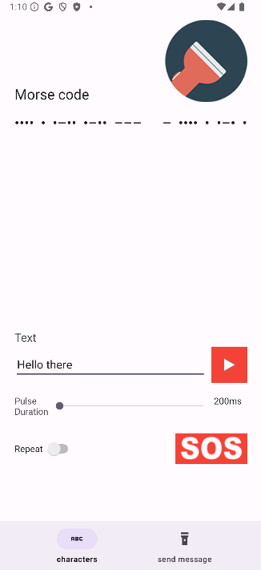
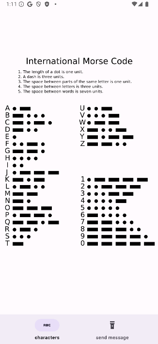

# MorseCodeFlash 

An android app that converts your message into morse code and then transmits it via flashlight.

## Functions

- Convert text into morse code
- Transmit the code as a flashlight signal
- Loop your messages

